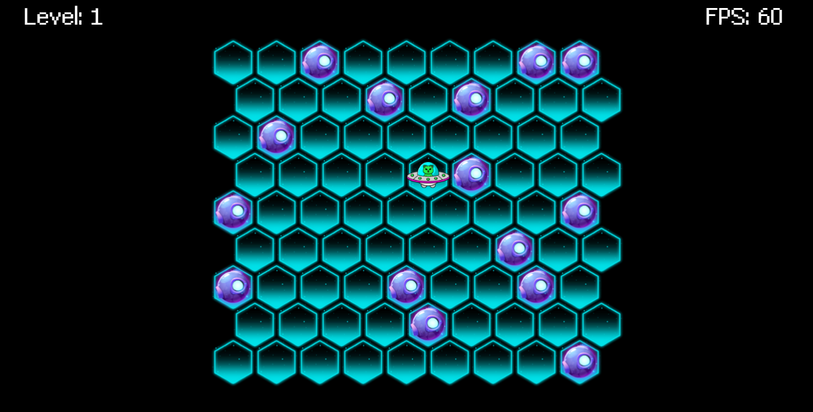

# Trò chơi "Vây bắt chiến thuật"
 

  

## Luật chơi

Nhiệm vụ của bạn là ngăn chặn UFO đang âm mưu tiếp cận Trái Đất với những ý đồ không tốt. Để làm điều này, bạn cần tạo ra một mạng lưới vật cản để ngăn UFO trốn thoát khỏi ma trận lục giác. 
UFO có thể di chuyển qua những ô lục giác trống và kề cạnh với ô mà nó đang đứng. Bạn có quyền đặt vô số vật cản để tạo ra các chướng ngại vật. Mỗi lượt, bạn được phép đặt một vật cản vào một ô lục giác trống. 
Hãy sử dụng chiến thuật của bạn để vây bắt UFO và ngăn chặn kế hoạch xấu xa của chúng!"

  

Trải nghiệm ngay [Tại đây](https://strategic-enclosure-game.vercel.app/)
